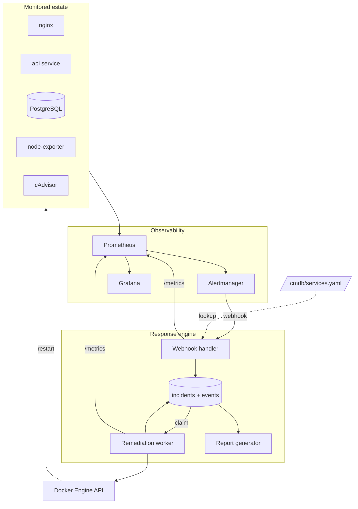

# SentinelOps — Design Notes

**Enterprise Incident Response & Operations Lab**

Author: Vicente Coelho
Last updated: 2026-08-09
Status: v1.2.1, reconciled post-Phase 1.2 architectural refactors

---

## What this is

SentinelOps is a lab environment I built to practise the full incident lifecycle, not just the monitoring part of it. Most monitoring labs stop once the alert fires. I wanted to see what happens after that: how the alert becomes an incident, who owns it,
what gets fixed automatically, what has to go to a human, and what record is left behind afterwards.

The flow I'm modelling:

```
Detect → Triage → Enrich → Remediate → Verify → Document → Audit
```

Prometheus and Grafana are components here, not the subject. The subject is incident management.

This document is my design and my reasoning. I wrote it before building so I'd stop changing my mind halfway through.

---

## Scope

### What I'm building

- A small monitored estate running in Docker Compose
- Prometheus + Alertmanager for detection and routing
- Grafana for dashboards
- A Python service that turns alerts into incidents, tries to fix them, and records what happened
- PostgreSQL for incident storage
- Bash scripts for setup, teardown, backup, and fault injection
- Runbooks and decision records

### What I'm deliberately not building

- Kubernetes
- Kafka, RabbitMQ, or Redis
- Elasticsearch
- Terraform or any cloud deployment
- Real ServiceNow API integration
- Alert correlation / ITIL Problem management
- Authentication on any of the web interfaces

Some of these are in `ROADMAP.md` as things I might add later. I left them out because each one adds a lot of complexity without making the incident lifecycle any clearer, and that lifecycle is the whole point.

### Two rules I set for myself

**1. Every feature has to support the operational story.**

If I catch myself adding something because it seems interesting rather than because it helps show how incidents are handled, it goes in the roadmap instead. I know from past projects that this is where I lose momentum.

**2. Every component has to fail independently.**

- Grafana down → monitoring and remediation keep working
- Report generator down → incidents are still detected and fixed
- Prometheus down → the response engine doesn't crash (`disk_cleanup`'s Prometheus query is the one narrow, deliberate exception to "never calls Prometheus" — a query failure escalates the incident rather than crashing the worker)
- Worker down → the webhook handler keeps accepting and saving alerts
- PostgreSQL down → the handler returns an error so Alertmanager retries instead of the alert disappearing

I'm treating this as something to actually test, not just intend. Each phase isn't done until I've killed each container in turn and checked the rest behaves this way.

---

## Architecture



### How a fault becomes a resolved incident

1. Prometheus notices something wrong and fires an alert.
2. Alertmanager groups it and posts it to my webhook handler.
3. The handler validates the payload, looks the service up in the CMDB file, and writes an incident row plus a `CREATED` event.
4. The worker picks up unclaimed incidents and moves them to `ACKNOWLEDGED`.
5. The worker runs whichever playbook the CMDB maps to that alert, logging each step.
6. It checks whether the service actually recovered. If yes, `RESOLVED`. If not, or if there was no playbook to run, `ESCALATED`.
7. The report generator renders the health page and timelines, and a PDF once I close the incident.
8. Both engine processes expose `/metrics`, so Prometheus scrapes them and Grafana can graph MTTR and remediation success rate.

### Why the handler doesn't do the remediation itself

This was the main structural decision. The obvious approach is to restart the container directly in the webhook handler. I split it into a handler and a worker with the database in between instead, for a few reasons:

**Alertmanager retries webhooks that time out.** A restart plus a health check can take 30+ seconds. If I hold the HTTP response open that long, Alertmanager may give up and resend the same alert, and I'd end up creating a second incident and restarting the service twice.

**Retries need to be safe.** Since retries are expected, the handler dedupes on the Alertmanager `fingerprint`. If there's already an open incident with that fingerprint, it appends an event rather than creating a new incident.

**Crashes shouldn't lose work.** If the worker dies mid-playbook, the incident is still in Postgres and can be picked up again.

It also means I can restart the worker without dropping incoming alerts, which made development a lot less annoying.

---

## Components

### Monitored estate

| Service         | Role                                              |
| --------------- | ------------------------------------------------- |
| `nginx`         | Web tier; also serves the health page and reports |
| `api`           | Small Python service, reads from PostgreSQL       |
| `postgres`      | Backs both the api service and incident storage   |
| `node-exporter` | Host CPU, memory, disk                            |
| `cAdvisor`      | Per-container metrics                             |

The `api` service has no fault-injection code in it. I originally planned endpoints like `/admin/fault/errors`, then decided against it — an app with failure switches built in isn't really the app I'm claiming to monitor. Faults get injected from outside by `chaos.sh` instead, which is closer to how chaos tooling actually works.

The api service only exposes what a normal service would:

- `GET /health` — used by the remediation worker to verify recovery
- `GET /metrics` — request count, latency histogram, error count
- A couple of endpoints that query PostgreSQL

That PostgreSQL dependency is useful for demos: stopping the database makes the api return genuine 5xx responses and real latency, which is a more realistic failure than a flag I flipped.

### Alert rules

Every rule carries `severity`, `service`, and `playbook` labels. The worker dispatches on the `playbook` label, so routing lives in config rather than in Python if-statements.

| Alert                        | Condition                    | Severity | Playbook              |
| ---------------------------- | ---------------------------- | -------- | --------------------- |
| `ServiceDown`                | `up == 0` for 1m             | critical | `restart_service`     |
| `ContainerRestartLoop`       | restarts increase > 3 in 10m | critical | `collect_diagnostics` |
| `HighErrorRate`              | 5xx ratio > 5% for 2m        | critical | `collect_diagnostics` |
| `HighLatency`                | p95 > 1s for 5m              | warning  | `collect_diagnostics` |
| `HighCPU`                    | CPU > 90% for 5m             | warning  | `collect_diagnostics` |
| `HighMemory`                 | memory > 85% for 5m          | warning  | `collect_diagnostics` |
| `DiskPressure`               | free < 15%                   | warning  | `disk_cleanup`        |
| `ResponseEngineDown`         | engine `up == 0` for 1m      | critical | none, manual          |
| `RemediationFailureRateHigh` | failures > 30% over 15m      | warning  | none, manual          |

The last two monitor my own engine. It felt wrong to build something that responds to outages and then not monitor whether it's alive.

### CMDB

One YAML file, `cmdb/services.yaml`. It's not a real CMDB and I'm not pretending it is — it's a lookup table so incidents arrive with ownership and criticality attached instead of just a container name.

```yaml
services:
  api:
    container_name: sentinelops-api
    owner: backend-team
    escalation_contact: backend-oncall@example.local
    tier: production
    criticality: high
    runbook: docs/runbooks/service-down.md
    verification:
      type: http
      url: http://api:5000/health
    playbooks:
      ServiceDown: restart_service
      HighCPU: collect_diagnostics
    sla:
      response_minutes: 5
      resolution_minutes: 30
    dependencies: [postgres]
```

A service that isn't in the file shouldn't crash the handler. It gets `owner: unassigned`, `criticality: unknown`, and goes straight to `ESCALATED` — which is roughly what should happen in reality when something unknown breaks.

Recovery verification is selected through the CMDB rather than hardcoded in the worker, so each service can use the verification strategy that matches the health signal it exposes (`http`, `docker-health`, or `running`; see ADR-008).

### Runbooks

Runbooks are organized around the operational response rather than the alert that triggered it. Multiple alerts can require the same response, so a single runbook can document the procedure for several alert types without duplicating instructions.

**Current limitation:** The CMDB schema associates a single `runbook` with each service. This is sufficient for services with one operational response, but cannot express different runbooks for different alerts affecting the same service. Extending the CMDB to support per-playbook or per-alert runbook mapping is deferred to a future phase.

### Response engine

Three processes sharing one codebase:

| Process              | Does                                                 | Doesn't                     |
| -------------------- | ---------------------------------------------------- | --------------------------- |
| `webhook_handler`    | Validate, dedupe, look up CMDB, save                 | Touch Docker, run playbooks |
| `remediation_worker` | Claim incidents, run playbooks, verify, update state | Accept HTTP input           |
| `report_generator`   | Render health page, timelines, PDFs                  | Change incident state       |

The handler uses the Prometheus `job` label as the service identifier, looks the service up in the CMDB, enriches the incident with ownership, SLA and operational metadata, and resolves the playbook from the CMDB. `handle_alert` is decomposed into modular lifecycle and duplicate reconciliation helper functions (`_reconcile_duplicate_alert`, `_create_new_incident_from_alert`) for clean separation of ingestion concerns.

Environment settings and service configuration are managed through centralized, immutable dataclasses defined in `automation/response_engine/config.py` (`DatabaseSettings`, `PrometheusSettings`, `DiagnosticsSettings`, `CMDBSettings`, `AlertmanagerSettings`). This provides consistent validation, fallback defaults, and dynamic repo-relative CMDB path resolution when executing outside Docker containers (such as in local CLI tools or tests).

The worker loads the CMDB once at process startup, not per poll cycle or per incident. Before executing a playbook, it checks that the incident's service still exists in that loaded snapshot; if the service is missing — because it was removed or renamed from `cmdb/services.yaml` after the worker started — the incident is escalated rather than retried forever. Because the CMDB is loaded once at startup, changes to `cmdb/services.yaml` are not visible to a running worker. Picking up a CMDB change requires restarting the worker.

**Handler response codes.** `200` once the incident is safely written. `4xx` for a payload that doesn't parse, since retrying won't help. `5xx` if the database write fails, so Alertmanager retries. I don't want to return `200` for an alert I didn't actually store.

**Claiming incidents.** `SELECT ... FOR UPDATE SKIP LOCKED`, so two workers can't grab the same incident. I'm only running one worker for now, but this was cheap to do correctly and expensive to fix later.

### Playbooks

| Playbook              | For                                      | What it does                                                                                    |
| --------------------- | ---------------------------------------- | ----------------------------------------------------------------------------------------------- |
| `restart_service`     | Service down                             | Check container exists, restart, wait, check `/health`, max 2 attempts with a cooldown          |
| `collect_diagnostics` | CPU, memory, error rate, latency         | Snapshot metrics, grab last 100 log lines and container stats, then escalate. Never restarts    |
| `disk_cleanup`        | Disk pressure                            | Prune reclaimable Docker data, prune old diagnostics artifacts by age, re-check via a scoped Prometheus query against the alert's own filesystem, escalate if still low |
| `none`                | Self-monitoring alerts, unknown services | Record and escalate immediately                                                                 |

**High CPU and high error rate don't trigger a restart, on purpose.** My first version restarted anything that alerted, and I changed it while writing the runbooks. If a service is pegged at 100% CPU and I restart it, I've thrown away the state that would tell me why, and I'll probably see the same alert again in twenty minutes with nothing new to go on. Restarting is only the right automated response when the process is actually gone. For saturation, the useful automated action is to collect evidence while the problem is still happening and hand it to a person.

Every playbook is bounded: max attempts, a timeout per step, a cooldown between attempts, and no playbook is allowed to trigger another playbook.

### Logging

All three processes log JSON to stdout, one object per line. No `print("Restarting container...")` anywhere.

```json
{
  "timestamp": "2026-08-02T15:42:13.104Z",
  "level": "info",
  "logger": "sentinelops.worker",
  "message": "Remediation attempt 1 succeeded",
  "incident_reference": "INC-2026-0007",
  "exception": null,
  "context": {
    "service": "api",
    "playbook": "restart_service",
    "attempt": 1,
    "duration_ms": 1420
  }
}
```

Every log line is JSON with `timestamp`, `level`, `logger`, and `message`. Log calls associated with a specific incident add `incident_reference`. Exceptions add a formatted `exception` field. Additional structured detail, where useful, goes in a free-form `context` object rather than a fixed `event` vocabulary.

Logs go to stdout only, never to files inside the container, and never include
credentials or `.env` contents.

I don't have a log platform in this project, so this is arguably premature. I did it anyway because changing log format later means touching every file, and if I do add Loki it becomes a config change instead of a rewrite.

---

## Data model

### `incidents`

| Column                                             | Type             | Notes                                 |
| -------------------------------------------------- | ---------------- | ------------------------------------- |
| `id`                                               | serial PK        |                                       |
| `reference`                                        | text unique      | `INC-2026-0001`                       |
| `fingerprint`                                      | text             | From Alertmanager, used for dedupe    |
| `alert_name`                                       | text             |                                       |
| `service`                                          | text             | CMDB key                              |
| `severity`                                         | text             |                                       |
| `status`                                           | text             | See state machine below               |
| `owner`, `tier`, `criticality`                     | text             | From CMDB                             |
| `playbook`                                         | text             | Resolved when the incident is created |
| `detected_at`                                      | timestamptz      | Alert `startsAt`                      |
| `acknowledged_at`, `resolved_at`, `closed_at`      | timestamptz null |                                       |
| `sla_response_minutes`, `sla_resolution_minutes`   | int              | From CMDB                             |
| `sla_response_breached`, `sla_resolution_breached` | bool             | Calculated                            |
| `root_cause_analysis`                              | text null        | I fill this in manually               |
| `labels`, `annotations`                            | jsonb            | Raw alert data                        |

There's a partial unique index on `fingerprint` where the status isn't terminal. That way the database enforces the dedupe rule rather than me trusting my own code to get it right every time.

### `incident_events` — append-only

| Column                     | Type                                                               |
| -------------------------- | ------------------------------------------------------------------ |
| `id`                       | serial PK                                                          |
| `incident_id`              | FK                                                                 |
| `sequence`                 | int, per incident                                                  |
| `occurred_at`              | timestamptz                                                        |
| `actor`                    | `alertmanager`, `worker`, or `operator`                            |
| `event_type`               | `CREATED`, `STATE_CHANGE`, `NOTE` |
| `from_status`, `to_status` | text null                                                          |
| `message`                  | text                                                               |
| `payload`                  | jsonb                                                              |

Nothing in this table is ever updated or deleted. I considered versioning the incident row instead, but an event log is simpler and gives me the audit trail, the timeline rendering, and the history in one mechanism. Monotonic event sequence numbers per incident are generated centrally via `create_incident_event` in `events.py` using PostgreSQL row-level locking (`SELECT COALESCE(MAX(sequence_number), 0) + 1 FROM incident_events WHERE incident_id = %s FOR UPDATE`) to prevent race conditions during concurrent updates.

### `remediation_attempts`

`id`, `incident_id`, `playbook`, `attempt_number`, `started_at`, `finished_at`, `result` (`success` / `failure` / `timeout` / `skipped`), `diagnostics_path`, `error`.

`incident_events` records the incident's lifecycle: creation, state transitions, and operator or system notes. Remediation execution detail — individual restart attempts, their timing, and their verification outcome — is recorded separately in `remediation_attempts` and joined by `incident_id` when reconstructing a complete incident timeline.

For services verified via `docker-health`, `restart_service`'s verification timeout is sized off the service's own Docker `HEALTHCHECK` interval and timeout (via `_verify_timeout_for()`), up to a `HEALTHCHECK_VERIFY_MAX` ceiling — a healthcheck interval + timeout beyond that ceiling can still let recovery go undetected until the next scheduled probe. Timestamps in `remediation_attempts` record real elapsed wall-clock time rather than transaction-start time.

---

## Incident states

| State                    | Meaning                                | Set by                    |
| ------------------------ | -------------------------------------- | ------------------------- |
| `NEW`                    | Created from an alert, not yet claimed | webhook handler           |
| `ACKNOWLEDGED`           | Claimed                                | worker (or me)            |
| `IN_PROGRESS`            | Playbook running                       | worker                    |
| `RESOLVED`               | Recovery verified                      | worker (or me)            |
| `ESCALATED`              | Automation can't or shouldn't continue | worker                    |
| `SUPPRESSED_MAINTENANCE` | Fired during a maintenance window      | webhook handler, terminal |
| `CLOSED`                 | RCA written, report generated          | me, terminal              |

Allowed transitions:

```
NEW                    → ACKNOWLEDGED | SUPPRESSED_MAINTENANCE | ESCALATED
ACKNOWLEDGED           → IN_PROGRESS | ESCALATED
IN_PROGRESS            → RESOLVED | ESCALATED
ESCALATED              → IN_PROGRESS | RESOLVED
RESOLVED               → CLOSED
SUPPRESSED_MAINTENANCE → terminal
CLOSED                 → terminal
```

An incident can move directly from `NEW` to `ESCALATED` if enrichment determines automation can't safely continue, because I don't want to record `ACKNOWLEDGED` for an incident no worker ever claimed.

An incident is open — eligible for fingerprint-based deduplication — while its status is `NEW`, `ACKNOWLEDGED`, `IN_PROGRESS`, or `ESCALATED`. Once an incident reaches `RESOLVED`, `CLOSED`, or `SUPPRESSED_MAINTENANCE`, a subsequent alert with the same fingerprint creates a new incident rather than appending to the old one.

I'm implementing this as one transition table and a single `transition(incident, to_status, actor, message)` function that checks against it and writes the event row. Anything not in the table raises and gets logged. I wanted every state to have one clear actor responsible for entering it, which is why there's no generic `OPEN` state — it didn't correspond to anyone doing anything.

---

## Maintenance windows

Alertmanager already has silences, so I'm using those rather than writing my own suppression logic. That part was easy to decide.

The part I did add: a silenced alert just disappears, which means there's no record that anything happened during a change window. So the engine still receives the event on a separate route and records it as `SUPPRESSED_MAINTENANCE`. It shows in the incident list but is excluded from SLA and MTTR figures.

`maintenance.sh` wraps the silence API — `start <service> <duration>`,
`end <silence-id>`, and listing active windows by default.

The wording I use in the README:

> Operational events occurring during approved maintenance windows are recorded for auditing purposes but do not generate actionable incidents.

---

## Output

### Health page

Static HTML, regenerated on a short interval, served by nginx. Deliberately basic: per-service status, open incident counts by severity, a table of open incidents with age and SLA state, and any active maintenance windows.

### Timeline

Just a rendering of `incident_events` in order:

```
15:42:10  alertmanager  ServiceDown fired for api
15:42:11  worker        INC-2026-0001 created (critical, backend-team)
15:42:12  worker        NEW → ACKNOWLEDGED
15:42:12  worker        ACKNOWLEDGED → IN_PROGRESS (restart_service)
15:42:13  worker        Restart attempt 1 of 2
15:43:41  worker        Health check passed (HTTP 200, 84ms)
15:43:52  worker        IN_PROGRESS → RESOLVED (1m 42s)
```

The rendered timeline combines incident lifecycle events with remediation execution history into a single chronological view.

### PDF report

Generated when I close an incident, written to `reports/INC-2026-0001.pdf`.

| Section                                                                          | Filled in by                                  |
| -------------------------------------------------------------------------------- | --------------------------------------------- |
| Summary                                                                          | automatic                                     |
| Detected condition (rule, threshold, duration)                                   | automatic                                     |
| Diagnostic evidence (metrics, last 100 log lines, container stats, alert labels) | automatic                                     |
| Timeline                                                                         | automatic                                     |
| Actions taken                                                                    | automatic                                     |
| Recovery time and SLA outcome                                                    | automatic                                     |
| **Root cause analysis**                                                          | **me — shows `PENDING RCA` until I write it** |

I originally had the report auto-fill a root cause field, and it was always just the alert name reworded — "Root cause: high CPU" isn't a root cause, it's the thing that alerted. The system can establish what happened and collect evidence around it, but working out why it happened is analysis, and I'd rather the report be honest that a human hasn't done that yet than print something that looks like a conclusion.

---

## Metrics from the engine

Both engine processes expose `/metrics`:

| Metric                                                    | Type      | For                               |
| --------------------------------------------------------- | --------- | --------------------------------- |
| `sentinelops_incidents_total{service,severity,status}`    | counter   | Volume                            |
| `sentinelops_incidents_active`                            | gauge     | Current open load                 |
| `sentinelops_queue_depth`                                 | gauge     | Unclaimed backlog                 |
| `sentinelops_remediation_attempts_total{playbook,result}` | counter   | Success rate                      |
| `sentinelops_incident_resolution_seconds`                 | histogram | MTTR                              |
| `sentinelops_incident_response_seconds`                   | histogram | Detection to acknowledgement      |
| `sentinelops_sla_breaches_total{type}`                    | counter   | Breaches                          |
| `sentinelops_worker_heartbeat_timestamp`                  | gauge     | Liveness for `ResponseEngineDown` |

MTTR in Grafana is calculated from real recorded incidents, not seeded data.

---

## Scripts

| Script           | Purpose                                                                                                |
| ---------------- | ------------------------------------------------------------------------------------------------------ |
| `bootstrap.sh`   | Prerequisite checks, config validation, `.env` setup, bring the stack up, wait for healthy, print URLs |
| `teardown.sh`    | Stop everything; `--purge` also removes volumes, with a confirmation                                   |
| `backup.sh`      | Export Grafana dashboards, `pg_dump` the incident data, archive with a timestamp, prune old backups    |
| `maintenance.sh` | Start / end / list Alertmanager silences                                                               |
| `chaos.sh`       | Inject faults for testing and demos                                                                    |
| `healthcheck.sh` | One-shot status of everything, non-zero exit if anything's wrong                                       |

All scripts use `set -euo pipefail`, have a `usage()`, quote their variables, and pass `shellcheck`.

### chaos.sh

Faults are applied from outside the monitored services.

| Command                     | How                                         | Should trigger                 |
| --------------------------- | ------------------------------------------- | ------------------------------ |
| `chaos.sh stop <service>`   | `docker stop`                               | `ServiceDown`                  |
| `chaos.sh cpu <service>`    | CPU load generator inside the container     | `HighCPU`                      |
| `chaos.sh memory <service>` | Memory load generator inside the container  | `HighMemory`                   |
| `chaos.sh disk`             | Allocate a large file in a monitored volume | `DiskPressure`                 |
| `chaos.sh dependency`       | Stop PostgreSQL so api fails on its own     | `HighErrorRate`, `HighLatency` |
| `chaos.sh reset`            | Undo everything, restore all services       | —                              |

`reset` has to work at any time, including after a scenario that half-failed. I use it constantly while testing.

### Config validation

`bootstrap.sh` checks configuration before starting anything and refuses to start if something's wrong. The alternative is finding out during an incident, which defeats the purpose.

| Check               | Fails if                                                                |
| ------------------- | ----------------------------------------------------------------------- |
| CMDB schema         | A service is missing `container_name`, `owner`, `criticality`, or `sla` |
| Duplicates          | The same service key appears twice                                      |
| Playbook references | CMDB names a playbook the worker doesn't implement                      |
| Runbook paths       | A `runbook:` path doesn't exist                                         |
| Container names     | A `container_name` isn't in `docker-compose.yml`                        |
| Alert coverage      | A configured Prometheus scrape job has no corresponding CMDB entry      |
| Alertmanager config | `amtool check-config` fails, or the maintenance route is missing        |
| Prometheus rules    | `promtool check rules` fails                                            |
| Host                | Docker or Compose missing, ports in use, not enough disk                |

It reports every problem it finds in one pass rather than stopping at the first, so I'm not fixing one thing at a time. Exits non-zero on any failure. `--validate-only` runs the checks without starting the stack.

`promtool` and `amtool` are already inside the Prometheus and Alertmanager images, so this needs nothing extra installed.

---

## Repository layout

```
SentinelOps/
├── README.md
├── ARCHITECTURE.md
├── ROADMAP.md
├── CHANGELOG.md
├── LICENSE
├── .env.example
├── docker-compose.yml
├── docker/
│   ├── prometheus/       prometheus.yml, rules/
│   ├── alertmanager/     alertmanager.yml
│   ├── grafana/          provisioning/, dashboards/
│   ├── nginx/            nginx.conf
│   └── api/              Dockerfile, app/
├── automation/
│   ├── response_engine/  handler, worker, playbooks, state machine, models, metrics
│   ├── reporting/        health page, timeline, PDF, templates/
│   └── scripts/          bootstrap.sh, teardown.sh, backup.sh, maintenance.sh, chaos.sh, healthcheck.sh
├── cmdb/
│   └── services.yaml
├── docs/
│   ├── DESIGN.md
│   ├── adr/
│   ├── runbooks/
│   └── screenshots/
├── reports/
└── tests/
```

---

## Decisions I want to keep a record of

These go in `docs/adr/` as short files — context, decision, consequences, what else I considered.

| ADR | Decision                                             | Short reason                                                                                                                             |
| --- | ---------------------------------------------------- | ---------------------------------------------------------------------------------------------------------------------------------------- |
| 001 | PostgreSQL, not SQLite                               | The handler, worker, and report generator all read and write concurrently. It's also the kind of database I'd meet in a real environment |
| 002 | Alertmanager silences, not a custom flag             | The tool already does suppression properly; I added an audit trail on top instead of reimplementing it                                   |
| 003 | Docker Compose, not Kubernetes                       | I want anyone to be able to run this on one machine. Nothing here needs orchestration                                                    |
| 004 | Queue between handler and worker                     | Alertmanager retries on timeout; doing the restart inline risks duplicates and loses work if the process dies                            |
| 005 | Collect evidence instead of restarting on saturation | Restarting a saturated service destroys the information needed to diagnose it                                                            |
| 006 | Root cause analysis stays manual                     | Automation can say what happened; why it happened is analysis                                                                            |
| 007 | YAML CMDB, not a database                            | I want incident enrichment, not to build a configuration management product                                                              |
| 008 | JSON logs with no log platform                       | Format is cheap to choose now and expensive to change later                                                                              |

---

## Documentation I'm writing alongside it

**README.md** in this order: Overview, Architecture, Quick Start, Repository Structure, Incident Lifecycle, Runbooks, Security Considerations, Design Decisions, Future Work. No emojis, no badge rows, screenshots of real output only.

**Runbooks**, one per alert type: symptom, how it's detected, what the automation does, how to verify manually, when to escalate. The CMDB points each service at its runbook, so the incident record links to the procedure.

**ROADMAP.md** for the things I left out on purpose:

> Alert correlation is intentionally left simple. Each alert currently creates an independent incident. Future work includes correlating related incidents into Problems following ITIL practices.

Also on that list: cloud deployment with Ansible, Loki, notification channels, and authentication.

---

## Security

This is going in the README, because it's a real trade-off I made rather than something I want to leave for someone to notice:

> The remediation engine needs access to the Docker Engine API in order to restart unhealthy services. In this lab the Docker socket is mounted directly into the engine container, which effectively gives it administrative control over the host.
>
> This is a deliberate trade-off for a self-contained lab environment and not something
> I would do in production. There, I would use:
>
> - a Docker socket proxy exposing only the endpoints actually needed
> - a scoped automation agent with the minimum privileges required
> - orchestrator-native mechanisms rather than direct daemon access
> - least privilege applied to every automation credential
>
> Other lab-only compromises: no authentication on Grafana or the health page, credentials supplied through `.env`, and `chaos.sh`, which is an operator tool that should never exist on a production host.

Practical rule for myself: `.env` is gitignored, `.env.example` is committed, and I check `git status` before every push.

---

## Phases

I'm building this in stages so there's always a working system rather than a half-finished one. My usual failure mode on side projects is starting the interesting part before the boring part works.

### Phase 1.1 — the core loop

Docker Compose estate, Prometheus, Alertmanager, Grafana, PostgreSQL, webhook handler with dedupe, CMDB enrichment, worker with `restart_service` and `collect_diagnostics`, state machine, `incident_events`, timeline, JSON logging, `bootstrap.sh` with config validation, `teardown.sh`, `chaos.sh`, README with the security section ARCHITECTURE.md, two runbooks, ADRs 001/003/004/005/008.

Logging and config validation are in Phase 1.1 because they're conventions rather than features — adding either later means going back through every file.

**Done when:** `chaos.sh stop api` produces an incident that gets detected, enriched from the CMDB, acknowledged, restarted, verified, and resolved without me touching anything; the timeline shows every step with timestamps; every log line from that incident is valid JSON with the incident reference; `bootstrap.sh --validate-only` catches a CMDB entry I've deliberately broken; and I've killed each container in turn to check the failure-independence rule holds.

### Phase 1.2 — the operational layer (Complete)

Maintenance windows, engine `/metrics`, SLA fields and breach calculation, MTTR dashboard, health page, PDF reports, `disk_cleanup`, `backup.sh`, `maintenance.sh`, `healthcheck.sh`, the remaining runbooks and ADRs, self-monitoring alerts.

**Done when:** closing an incident produces a PDF with real diagnostic evidence and an RCA I've written, and Grafana shows MTTR calculated from actual incidents. (Completed & Verified).

### Phase 3 — Production Readiness & Extensibility

Focuses on engineering rigor (GitHub Actions CI, automated E2E chaos testing, zero-friction verification), architectural extensibility (reliability primitives `correlation_id`/`execution_id`, generalized typed event model, formalized `/api/v1` REST interface, remediation plugin registry), and operational intelligence (alert correlation into Problem records, operational analytics, and AI Knowledge Assistant RAG).

**Done when:** Tier 1 engineering quality gates pass in CI; the automated E2E chaos suite validates the defined incident lifecycle scenarios; Tier 2 reliability, event, API, and remediation extensibility boundaries are implemented and tested; and the Tier 3 operational-intelligence features defined in `ROADMAP.md` are implemented and validated.

### Later (Post-v1)

Production Deployment Hardening (Authentication/RBAC, secret management, Docker socket proxy), cloud deployment (Ansible/Terraform), Loki/Vector centralized logging, and external notification channels. The full execution plan and technical trade-offs are documented in `ROADMAP.md`.

---

## Changes to this document

I froze this at v1.0 before starting Phase 1.1. I'll update it if building reveals something that genuinely can't work as designed — not because I've thought of something else I'd like to add. Those go in the roadmap. If I do change a recorded decision, it gets a note in CHANGELOG.md and an ADR.

This is the v1.1 reconciliation pass: ten discrepancies between this document and the implemented system, discovered and recorded during Phase 1.1 in `docs/implementation-findings.md`, were folded back into the relevant sections above in one batched update, per the policy stated in the paragraph above. See `CHANGELOG.md` for a summary of what changed. One finding (CMDB-driven recovery verification) was already adequately covered by ADR-008, so no new ADR was needed for this pass.

This is the Phase 1.2 reconciliation pass (2026-08-09): three Phase 1.2 discrepancies/clarifications (findings 11, 12, and 13 covering Alertmanager silence maintenance suppression, asynchronous SLA breach evaluation with `clock_timestamp()`, and decoupled report generation) were recorded in `docs/implementation-findings.md`, reconciled into project documentation, and formalized as ADRs 009, 010, and 011 alongside new Phase 1.2 operational runbooks.

This is the v1.2.1 post-Phase 1.2 architectural refactoring pass (2026-08-09): recorded centralized configuration dataclasses (`automation/response_engine/config.py`), database row-level locking for per-incident event sequence generation (`events.py`), modular alert processing lifecycle helpers (`handlers.py`), dynamic CMDB path resolution, and strict database connection type hinting across response engine modules.
